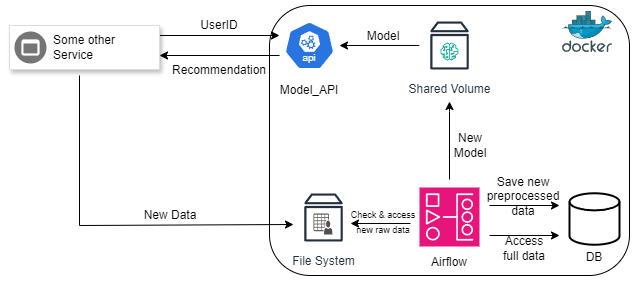

🎬 Movie Recommendation System
==============================
The Movie Recommendation System develops a movie recommendation system for a streaming platform. The recommendation system leverages collaborative filtering techniques, utilizing user ratings and movie genre data to generate personalized movie recommendations.

This project is a comprehensive MLOps implementation designed to enhance user experience by suggesting movies that align with individual tastes. This project is based on [the MovieLens 20M Dataset](https://grouplens.org/datasets/movielens/20m/).

👨🏼‍💻👩‍💻👨🏻‍💻 Development Team
==============================
The Movie Recommendation System has been developed by:

    -Dennis Rothfuss
    -Eva Losada Barreiro

🏗️ Architecture
==============================
<p align="center">
    
</p>
<p align="center">
    <b>Figure 1.</b> Movie Recommendation System architecture
</p>

To be able to map the whole workflow and lifecycle of a MLOPS project we decided to use the following systems and modules:
* We build a custom Rest API for the predictions called Model_API using python and FastAPI.
* To ensure that the functionality still works after doing changes we have built a CI pipeline with GitHub Actions which runs the unit tests after every code change.
* As we use Docker to build our environment we also created a CD pipeline which builds a docker image for the Model_API and uploads the image to DockerHub.
* To run the whole environment we are using Docker-Compose with several containers, including our Model_API container as well as a DB container, a PGAdmin container (GUI for our DB) and several Airflow Containers.
* To preprocess new raw data and to retrain our Model we created a workflow in Airflow which processed the new data, stores it in our Database, retrains the model and replaces the old model if the new models performs better.
* Replacing the model in the API is done without interruption as we are using a shared volume between Airflow and the Model_API and then triggering the API to just load the new model while running.

📂 Project Organization
==============================

```
.github/
├── workflows/
│   ├── build-and-push-dockerimages.yml
│   └── python-app.yml
models/
├── .gitkeep
├── model.pkl
notebooks/
├── .gitkeep
references/
├── .gitkeep
reports/
├── figures/
│   └── .gitkeep
src/
├── data/
│   ├── .gitkeep
│   ├── __init__.py
│   ├── check_structure.py
│   ├── import_raw_data.py
│   └── make_dataset.py
├── features/
│   ├── .gitkeep
│   ├── __init__.py
│   └── build_features.py
├── model_api/
│   ├── Dockerfile
│   ├── model_api.py
│   ├── requirements.txt
│   └── test_api.py
├── models/
│   ├── .gitkeep
│   ├── __init__.py
│   ├── predict_model.py
│   └── train_model.py
├── visualization/
│   ├── __init__.py
│   └── config
volumes/
├── .gitignore
├── LICENSE
├── README.md
├── docker-compose.yml
├── requirements.txt
└── setup.py
```

👩‍💻 Development
==============================
Running the `Model_API` application in `development` mode means to run the application locally without using Docker.
To run the application in `development` mode you need to follow the following steps:

### 1- Create a virtual environment using Virtualenv

    python -m venv my_env
    . my_env/Scripts/activate

### 2- Install the packages from requirements.txt

    pip install -r requirements.txt
    pip install -r src/model_api/requirements.txt 

### 3- Execute import_raw_data.py to import the 4 datasets (say yes when it asks you to create a new folder)

    python src/data/import_raw_data.py 

### 4- Set the necessary environment variables

    export ADMIN_USERNAME=admin
    export ADMIN_PASSWORD=admin

### 5- Start the Model_API application (from the model_api src folder)

    cd src/model_api
    python model_api.py

### 6- After starting the application the Rest API Documentation is available here: [Model_API](http://localhost:8000/docs)

### To adjust the workflow we have built in airflow you can change the DAG developed in `volumes/dags/airflow.py`

👟 Running the App
==============================
Running the application in our `production` like environment means to run it using the docker-compose environment we build.
To run the application and the airflow workflow you can follow the following steps:

### 1- Download the images, setup the environment and start the containers

    docker-compose up -d

### 2- Access the services using the following links
1. [Model_API](http://localhost:8889/docs)
2. [PGAdmin](http://localhost:8888)
3. [Airflow](http://localhost:8080)
4. [Airflow Celery Flower](http://localhost:5555)

### 3- To be able to run the airflow workflow (DAG name: `data_model_pipeline`)
Go to the admin -> connections tab and add a new connection. The connection id needs to be set to `file_system` and the type to `File [Path]`, then save the connection.
